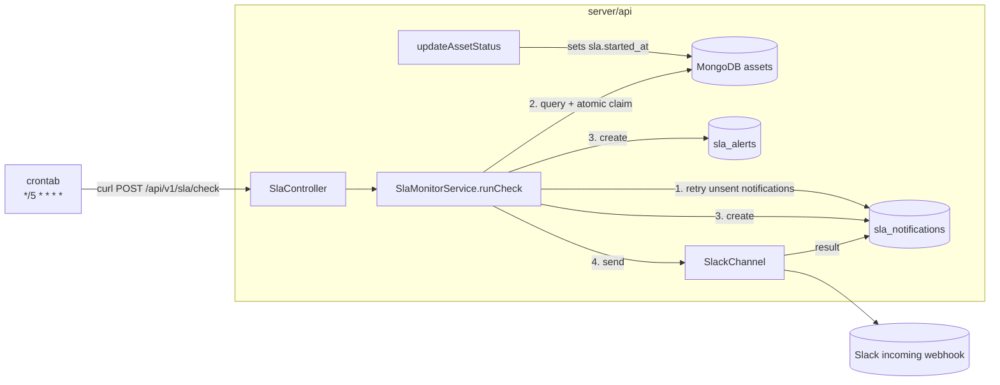

# Spec: Video Processing SLA Alerting

| | |
|---|---|
| Status | Draft |
| Owner | Toufiq |
| Created | 2026-10-08 |
| Affected service | `server/api` (no worker changes) |

## 1. Problem

We commit to an SLA: **a video must reach `READY` within 60 minutes of being uploaded.** Today nobody finds out when a video gets stuck. A worker could be down, a BullMQ job could be lost, Redis could be unavailable, or ffmpeg could hang, and we only notice when a user complains, which is usually after the SLA has already been missed.

## 2. Goal

Send an early warning **30 minutes** after upload for any video that is still not `READY`. That leaves about 30 minutes to step in before the 60-minute SLA is missed. Alerts go to **Slack**.

### In scope
- Track when each asset's SLA clock starts.
- A plain HTTP endpoint that finds assets past the warning threshold and still not `READY`, triggered **every 5 minutes by crontab**.
- Deliver alerts to a Slack channel through an incoming webhook.
- Send exactly one alert per asset per threshold, even when runs overlap or a delivery is retried.
- Store every alert and its delivery result for auditing.
- **No dependency on Redis/BullMQ.** Alerting must keep working while Redis is down, because a Redis outage is one of the main reasons videos get stuck.

### Out of scope (v1)
- Alerts to individual customers. These are internal ops alerts for the platform team; customers already get `asset.status.*` webhooks.
- Automatic fixes. The existing `POST /api/v1/cron-jobs/verify-bullmq-jobs` stays a manual or cron action.
- Dashboard or UI for SLA metrics. See §13, Phase 2.
- Direct (tus) uploads. They're disabled today and never pass through `DOWNLOADING`. When tus is re-enabled, add `UPLOADED` as a second clock-start status in `SlaClockService.shouldStartClock()`.
- Email, PagerDuty, SMS and other channels. The channel abstraction in §7 makes these easy to add later (see §13).

## 3. Definitions

| Term | Definition |
|---|---|
| **SLA clock start** (`sla.started_at`) | The moment the asset moves to `DOWNLOADING`. That is the only status that starts the clock. `RE_PROCESSING` clears the clock, and it starts again when the reprocessed asset moves to `DOWNLOADING`. |
| **Ready** | `asset.latest_status === VIDEO_STATUS.READY` |
| **Warning threshold** | `SLA_WARNING_THRESHOLD_MINUTES`, default `30` |
| **SLA target** | `SLA_TARGET_MINUTES`, default `60`. Shown in alert text. |
| **SLA check** | One run of the overdue-video detection, triggered by `POST /api/v1/sla/check`. |
| **Pending asset** | Not deleted, `sla.started_at` is set, `latest_status` is not `READY`, and no alert has been sent yet for the threshold being checked. |

`DOWNLOADING` is when processing actually begins: `afterSave` pushes the download job and then sets `DOWNLOADING`. Reprocessing follows the same path (`RE_PROCESSING → DOWNLOADING`), so one rule covers both. Assets that never reach `DOWNLOADING` are deliberately outside the SLA; see §11.

## 4. Current state (relevant facts)

- Assets live in MongoDB (`assets` collection, `server/api/src/api/assets/schemas/assets.schema.ts`). They have `latest_status`, `status_logs[]` (each entry with timestamps), `is_deleted`, `user_id`, `createdAt` and `updatedAt`.
- Every status change goes through `AssetService.updateAssetStatus()` (`asset.service.ts`), which does a `findOneAndUpdate`. A `post('findOneAndUpdate')` hook in `assets.module.ts` then calls `afterUpdateLatestStatus` when `$set.latest_status` changes.
- Statuses (`video-touch-common`): `QUEUED, ON_HOLD, UPLOAD_PENDING, UPLOADED, DOWNLOADING, DOWNLOADED, VALIDATED, PROCESSING, READY, FAILED, RE_PROCESSING`.
- Periodic maintenance is already done by crontab calling `POST /api/v1/cron-jobs/*` endpoints with `curl` (`cronjob.controller.ts`, `server/scripts/cleanup.sh`, `server/scripts/verify-bullmq-jobs.sh`). This feature follows the same pattern.
- The API already has `HttpService` (`@nestjs/axios`), used by `WebhookNotifyConsumer` for outbound HTTP. No new dependencies are needed.
- The tus upload server in `tus.service.ts` is currently commented out, so all live traffic is URL imports, which always go through `DOWNLOADING`. Direct tus uploads would go `UPLOAD_PENDING → UPLOADED → VALIDATED` and **never** reach `DOWNLOADING`, so they're out of scope until tus is re-enabled (§2).

## 5. Design overview

Crontab calls a REST endpoint every 5 minutes. The endpoint queries MongoDB, claims overdue assets, and posts to Slack **in the same request**. Delivery state is stored in MongoDB, so a failed Slack post is retried on the next check. Redis isn't touched anywhere.



**Why a periodic check instead of a timer per asset.** A delayed job per asset (fired at T+30m) would need a scheduler that remembers it. A check queries MongoDB, which is the source of truth, so it heals itself, catches anything it missed on a previous run, and can safely run any number of times. The trade-off is that an alert can arrive up to one cron interval late (30 to 35 minutes with a 5-minute cron). That's fine against a 60-minute SLA.

**Why crontab + endpoint instead of a BullMQ job scheduler.** BullMQ keeps its schedules and jobs in Redis. When Redis is down, a BullMQ scheduler stops, and that is exactly when the pipeline stalls and alerts matter most. Crontab plus an endpoint that only uses MongoDB and outbound HTTPS keeps alerting independent of the system it's watching. It also matches how `cleanup-device` and `verify-bullmq-jobs` are already triggered.

**Why Slack is sent inline instead of through a queue.** For the same reason: a delivery queue would depend on Redis. A check sends at most a handful of Slack messages (§8.2 step 5 groups large batches into one digest), so sending them inside the request stays well under the `curl` timeout. Messages that fail are stored and retried on the next check (§8.4).

## 6. Data model changes

### 6.1 `assets`: new embedded `sla` subdocument

```ts
// server/api/src/api/assets/schemas/sla.schema.ts
@Schema({ _id: false })
export class AssetSlaDocument {
  @Prop({ required: false }) started_at?: Date;
  @Prop({ required: false }) warning_alerted_at?: Date;  // set when the warning alert is claimed
}

// assets.schema.ts
@Prop({ required: false, type: AssetSlaSchema, default: undefined })
sla?: AssetSlaDocument;
```

New index, which the check query uses:

```ts
VideoSchema.index({ 'sla.started_at': 1, latest_status: 1 }, {
  partialFilterExpression: { 'sla.started_at': { $exists: true } },
});
```

### 6.2 New collection: `sla_alerts`

The audit log. Each document is one alert for one asset at one tier.

```ts
// server/api/src/api/sla/schemas/sla-alert.schema.ts
@Schema({ timestamps: true, collection: 'sla_alerts' })
export class SlaAlertDocument extends AbstractDocument {
  @Prop({ required: true, type: Types.ObjectId, index: true }) asset_id: Types.ObjectId;
  @Prop({ required: true, type: Types.ObjectId }) user_id: Types.ObjectId;
  @Prop({ required: true }) tier: 'WARNING';                 // only tier in v1
  @Prop({ required: true }) threshold_minutes: number;
  @Prop({ required: true }) asset_status_at_alert: string;   // latest_status when detected
  @Prop({ required: true }) sla_started_at: Date;
  @Prop({ required: true }) elapsed_minutes: number;
  @Prop({ required: true, type: Types.ObjectId, index: true }) notification_id: Types.ObjectId; // -> sla_notifications
}
// Unique index: a second guarantee against duplicate alerts on top of the atomic claim in §8.2
SlaAlertSchema.index({ asset_id: 1, tier: 1, sla_started_at: 1 }, { unique: true });
```

`sla_started_at` is part of the unique key, so a reprocessed asset (new clock) can be alerted again.

### 6.3 New collection: `sla_notifications`

The outbox. Each document is one outgoing Slack message: either a single-asset alert or a digest covering several assets. Storing the rendered payload means a retry resends exactly the same message, even if the assets have changed since.

```ts
// server/api/src/api/sla/schemas/sla-notification.schema.ts
@Schema({ timestamps: true, collection: 'sla_notifications' })
export class SlaNotificationDocument extends AbstractDocument {
  @Prop({ required: true }) channel: 'SLACK';            // widen the union when more channels are added
  @Prop({ required: true }) kind: 'SINGLE' | 'DIGEST' | 'TEST';
  @Prop({ required: true }) tier: 'WARNING';
  @Prop({ required: true, type: [Types.ObjectId] }) asset_ids: Types.ObjectId[];
  @Prop({ required: true, type: Object }) payload: Record<string, any>; // rendered Slack Block Kit body
  @Prop({ required: true }) status: 'PENDING' | 'SENT' | 'FAILED';
  @Prop({ required: true, default: 0 }) attempts: number;
  @Prop({ required: false }) next_attempt_at?: Date;
  @Prop({ required: false }) last_error?: string;         // trimmed to 1 KB
  @Prop({ required: false }) sent_at?: Date;
}
SlaNotificationSchema.index({ status: 1, next_attempt_at: 1 });
```

### 6.4 Migration and backfill

**No backfill.** Existing assets don't have `sla.started_at`, so the check ignores them. This is deliberate: it prevents a flood of alerts on deploy day about assets that have been stuck for months. The check also has a lookback limit (`SLA_LOOKBACK_HOURS`, default 24) as a second guard against alerting on very old assets.

## 7. Module structure

Add a new `SlaModule` at `server/api/src/api/sla/`:

```
sla/
  sla.module.ts
  schemas/
    sla-alert.schema.ts
    sla-notification.schema.ts
  repositories/
    sla-alert.repository.ts                 # extends BaseRepository
    sla-notification.repository.ts
  services/
    sla-monitor.service.ts                  # runCheck(): retry outbox, detect, claim, send
    sla-clock.service.ts                    # pure helpers: shouldStartClock(), buildSlaUpdate()
    sla-alert-formatter.service.ts          # builds Slack Block Kit payloads
  channels/
    notification-channel.interface.ts
    slack.channel.ts
  guards/internal-api-key.guard.ts
  controllers/sla.controller.ts             # check endpoint + test notification + alert listing
```

```ts
// channels/notification-channel.interface.ts
export interface NotificationChannel {
  readonly name: 'SLACK';
  isEnabled(): boolean;
  send(payload: Record<string, any>): Promise<void>; // throws on failure
}
```

Slack is the only channel in v1. The interface is kept so email or PagerDuty can be added later as another implementation, with no changes to the check logic.

`SlaModule` imports `MongooseModule.forFeature` for `sla_alerts` and `sla_notifications`, and reuses `AssetRepository` and `FileRepository` through `AssetsModule` exports. It doesn't import `BullModule` or `RabbitMQModule`.

## 8. Behavior

### 8.1 Starting the clock (`AssetService.updateAssetStatus`)

Extend the existing `findOneAndUpdate` to set the SLA fields **in the same update**. That way the status change and clock start can't get out of sync.

```ts
const now = new Date();
const update: UpdateQuery<AssetDocument> = {
  latest_status: status,
  $push: { status_logs: { status, details } },
};

if (status === VIDEO_STATUS.RE_PROCESSING) {
  // Clear the old clock; it restarts when the asset moves to DOWNLOADING.
  update.$unset = { 'sla.started_at': '', 'sla.warning_alerted_at': '' };
}

const result = await this.repository.findOneAndUpdate(filter, update);

if (status === VIDEO_STATUS.DOWNLOADING) {
  // Start the clock only if it isn't already running.
  // updateOne (not findOneAndUpdate) so the asset post-hook doesn't fire a second time.
  await this.assetModel.updateOne(
    { _id: videoId, 'sla.started_at': { $exists: false } },
    { $set: { 'sla.started_at': now } },
  );
}
```

Rules:
- **Starting** (`DOWNLOADING`): set `sla.started_at = now` **only if it isn't set yet**. `updateAssetStatus` already skips an update when the status hasn't changed, but the `$exists: false` guard also keeps the clock from moving if `DOWNLOADING` is ever set twice in one processing run.
- **Restarting** (`RE_PROCESSING`): clear `started_at` and `warning_alerted_at` in the same update. The next `DOWNLOADING` starts a fresh clock.
- **Stopping** (`READY`): nothing to write. The check's `latest_status != READY` filter excludes these assets.
- Keep `latest_status` as a top-level field in the update. The existing post hook checks `this._update.$set.latest_status`, and Mongoose moves top-level fields into `$set`, so behavior doesn't change. Add a unit test to make sure the hook still fires.

### 8.2 The check (`SlaMonitorService.runCheck()`)

Called by `POST /api/v1/sla/check`. Runs the steps in this order:

**Step 1. Retry unsent notifications.** Load `sla_notifications` with `status: 'PENDING'` and `next_attempt_at <= now`, oldest first, up to 20. Send each one (§8.4). This runs first, so a Slack outage on a previous check is recovered before new alerts are added.

**Step 2. Find candidates** for the warning tier (threshold `T` minutes, flag field `F` = `sla.warning_alerted_at`). Capped at `SLA_CHECK_BATCH_LIMIT` (default 500):

```js
// cutoff = now - T min, lookback = now - SLA_LOOKBACK_HOURS
{
  is_deleted: { $ne: true },
  'sla.started_at': { $lte: cutoff, $gte: lookback },
  latest_status: { $ne: 'READY' },
  [F]: { $exists: false },
}
```

`FAILED` assets **are included**: a failed video has missed the SLA, and ops needs to know. The alert shows the status, so it's clear whether the video is stuck or failed. See open question Q2.

**Step 3. Claim** each candidate atomically: `updateOne({ _id, [F]: { $exists: false }, latest_status: { $ne: 'READY' } }, { $set: { [F]: now } })`. Only continue with assets where `modifiedCount === 1`. This makes overlapping checks safe without a lock (for example, a slow run still going when cron fires again, or someone calling the endpoint by hand). It also covers an asset that became `READY` between the query and the claim. Use `updateOne` so the asset post-hook doesn't fire.

**Step 4. Build and store messages.**
- If the number of claimed assets is greater than `SLA_DIGEST_THRESHOLD` (default 5), build **one** digest message listing all of them. Otherwise build one message per asset. Many assets crossing the threshold at once usually means one shared cause (a worker down, Redis down), and 40 separate Slack messages would bury that signal.
- Insert the `sla_notifications` document(s) with `status: 'PENDING'`, `attempts: 0`, `next_attempt_at: now`.
- Insert one `sla_alerts` document per claimed asset, pointing at its notification. On a duplicate-key error (E11000), drop that asset from the message because it was already alerted.
- If an insert fails for any other reason, **roll back the claim** for the affected assets with `$unset: { [F]: '' }` so the next check tries again. Losing an alert is worse than sending it twice.

**Step 5. Send** the new notifications (§8.4).

**Step 6. Return** a summary, which crontab logs:

```json
{
  "skipped": false,
  "retried": { "attempted": 1, "sent": 1, "failed": 0 },
  "tier": "WARNING",
  "candidates": 3,
  "claimed": 3,
  "notifications": { "created": 3, "sent": 3, "pending": 0 },
  "digest": false,
  "duration_ms": 842
}
```

When `SLA_ALERTS_ENABLED=false`, the endpoint returns `200 { "skipped": true }` without doing anything, so the crontab entry can stay in place.

A check is safe to run at any time and any number of times.

### 8.3 Endpoints (`SlaController`)

Following the `CronjobController` pattern, versioned under `/api/v1/sla`:

| Method | Path | Purpose |
|---|---|---|
| `POST` | `/api/v1/sla/check` | Run one check (§8.2). **Called by crontab every 5 minutes**, and can be called by hand after an incident or in tests. |
| `POST` | `/api/v1/sla/test-notification` | Send a clearly marked `[TEST]` message to Slack, to check the webhook setup. |
| `GET` | `/api/v1/sla/alerts?asset_id=&from=&to=` | List `sla_alerts` with their notification status, for debugging. |

All three are protected by a new `InternalApiKeyGuard` that checks the `x-internal-api-key` header against `INTERNAL_API_KEY`. If `INTERNAL_API_KEY` is unset, they return 503. The existing `cron-jobs` endpoints have **no auth** at all. We should put this guard on them too, but that's tracked separately and isn't part of this work.

The check endpoint uses `POST` because it changes state (claims assets, sends messages).

### 8.4 Sending a notification

For each `sla_notifications` document being sent:
1. Call `SlackChannel.send(payload)`.
2. On success: `status: 'SENT'`, `sent_at: now`, `attempts + 1`.
3. On failure: `attempts + 1`, store `last_error`, and set `next_attempt_at = now + backoff`, where the backoff is 5, 10, 20 and 40 minutes for attempts 1 to 4. Because checks run every 5 minutes, this works out to one retry per check at first, then slower. After `SLA_MAX_DELIVERY_ATTEMPTS` (default 5) failures, set `status: 'FAILED'` and log at `error` level.

Update the document with a filter on its current `attempts` value, so two overlapping checks can't both send the same retry.

There's no in-request retry loop: one attempt per check keeps each request short and predictable.

## 9. Slack channel

- Transport: a Slack **incoming webhook** (`SLA_SLACK_WEBHOOK_URL`). This avoids needing a bot token or OAuth. Send with `HttpService.post` and a 5 s timeout, like the existing `WebhookNotifyConsumer`.
- A non-2xx response or a timeout throws. On HTTP 429, use `Retry-After` as the `next_attempt_at` delay.
- Payload: Block Kit with a plain `text` fallback for notifications.

Single-asset message:

```
:warning: SLA warning: video not ready after 32 min (SLA 60 min)
*Title:* My launch video
*Asset ID:* 66f1c0...e2
*Status:* PROCESSING  •  *Started:* 2026-10-08 10:04 UTC  •  *Time left:* ~28 min
*Owner:* user@example.com
*Files:* 360p READY, 480p READY, 720p PROCESSING, 1080p QUEUED, thumbnail READY
```

Digest message: a header like `:rotating_light: 14 videos not ready after 30 min (SLA 60 min). Possible systemic issue`, then up to 20 rows (`title | asset_id | status | elapsed`), then "…and N more".

The per-file breakdown matters: it shows ops which worker is stuck. Get it with one `FileRepository.find({ asset_id })` per asset, or a single `$in` for a digest.

The channel counts as **enabled** only when `SLA_SLACK_WEBHOOK_URL` is set. If `SLA_ALERTS_ENABLED=true` but the webhook URL is missing, log an error at startup, and have the check endpoint return `500` with a clear message so the failure shows up in the cron log.

## 10. Configuration

### 10.1 Environment variables

Add these to `environment.ts`, `app-config.service.ts` and `server/example.env`. Use `configService.get` with defaults, **not** `getOrThrow`, so the API still boots when SLA isn't configured.

| Variable | Default | Description |
|---|---|---|
| `SLA_ALERTS_ENABLED` | `false` | Master switch. When `false`, the check endpoint does nothing. |
| `SLA_TARGET_MINUTES` | `60` | SLA target; shown in messages. |
| `SLA_WARNING_THRESHOLD_MINUTES` | `30` | When the warning alert fires. |
| `SLA_LOOKBACK_HOURS` | `24` | Ignore assets whose clock started before this. |
| `SLA_CHECK_BATCH_LIMIT` | `500` | Maximum assets claimed per check. |
| `SLA_DIGEST_THRESHOLD` | `5` | Above this many alerts in one check, send a single digest. |
| `SLA_MAX_DELIVERY_ATTEMPTS` | `5` | Slack attempts before a notification is marked `FAILED`. |
| `SLA_SLACK_WEBHOOK_URL` | – | Slack incoming webhook. Required when alerts are enabled. |
| `INTERNAL_API_KEY` | – | Required for `/api/v1/sla/*` endpoints. |

The check interval isn't an env var: it's set in the crontab entry.

Startup validation: if `SLA_ALERTS_ENABLED=true` and `SLA_WARNING_THRESHOLD_MINUTES >= SLA_TARGET_MINUTES`, log an error.

### 10.2 Crontab

Add `server/scripts/sla-check.sh`, in the same style as the existing scripts:

```bash
#!/bin/bash
# Runs one SLA check. Scheduled by crontab every 5 minutes.
curl --silent --show-error --fail \
  --max-time 120 \
  --request POST \
  --header "x-internal-api-key: ${INTERNAL_API_KEY}" \
  --url http://localhost:3000/api/v1/sla/check
echo
```

Crontab entry on the host that runs the API:

```cron
*/5 * * * * INTERNAL_API_KEY=xxx /path/to/video-touch/server/scripts/sla-check.sh >> /var/log/video-touch/sla-check.log 2>&1
```

- `--fail` makes `curl` exit non-zero on a 4xx/5xx, so failures show up in the log.
- `--max-time 120` stops a stuck request from piling up. Overlapping runs are safe anyway (§8.2 step 3).
- The URL is hard-coded, like in the existing scripts. Change the port to match the host's `API_PORT`.
- With several API replicas, point the URL at the load balancer or a single instance. Only one check per interval is needed, and an occasional duplicate call does no harm.

## 11. Edge cases

| Case | Behavior |
|---|---|
| **Redis is down** | Alerting keeps working: the check only uses MongoDB and Slack. Videos that were already `DOWNLOADING` or further along when Redis went down are reported as normal, and the Slack digest makes the shared cause obvious. New imports during the outage never reach `DOWNLOADING`, so they aren't alerted (see the "Asset never reaches `DOWNLOADING`" row below). |
| **RabbitMQ is down** | Same as above; the check doesn't use it. |
| **MongoDB is down** | The check fails with a 500 and `curl` logs it. Nothing can be alerted on without the data, and the whole platform is down anyway. |
| **Crontab stops running** (host rebooted, entry removed) | No alerts are sent and nothing complains. Mitigation in Phase 2: a dead-man's switch on the time of the last successful check (§13). |
| Two checks overlap (slow run, or manual call during a cron run) | The atomic claim and the unique index on `sla_alerts` stop duplicate alerts. The `attempts` filter stops duplicate retries. |
| Asset becomes `READY` between query and claim | The claim filter has `latest_status: { $ne: 'READY' }`, so nothing is claimed and no alert is sent. |
| Asset becomes `READY` after the claim, before Slack is called | The alert is still sent. A rare race that's safe to accept. Phase 2 adds "resolved" follow-ups. |
| Asset soft-deleted while pending | Excluded by `is_deleted: { $ne: true }`. |
| Asset `FAILED` before 30 min | Alerted at the next check after 30 minutes, with status `FAILED` in the message. See Q2. |
| Asset reprocessed after an alert | `RE_PROCESSING` clears the clock and flags. The clock restarts at the next `DOWNLOADING`, so it can be alerted again. The unique key includes `sla_started_at`. |
| Asset never reaches `DOWNLOADING` (stays `QUEUED`/`ON_HOLD`, or goes straight to `FAILED`) | The clock never starts, so there's no alert. This is by design. The main case is a Redis outage at import time: `afterSave` pushes the download job to Redis **before** setting `DOWNLOADING`, so the push fails (asset goes to `FAILED`) or hangs (asset stays `QUEUED`). Those videos are never alerted. Redis being down should be caught by infrastructure monitoring, not by SLA alerting. |
| Slack is down | The notification stays `PENDING` and is retried on later checks with backoff (§8.4). After 5 failures it's marked `FAILED` and logged. |
| API was down for hours, then comes back | The first check picks up every overdue asset in the lookback window, and the digest groups them into one message. |

## 12. Rollout

1. **Ship dark:** merge with `SLA_ALERTS_ENABLED=false`. `sla.started_at` starts filling in for new assets right away, because the clock logic doesn't depend on the flag.
2. **Configure Slack:** create the incoming webhook for the `#video-touch-alerts` channel, set `SLA_SLACK_WEBHOOK_URL` and `INTERNAL_API_KEY`, and call `POST /api/v1/sla/test-notification`.
3. **Install the crontab entry** (§10.2). With alerts still disabled, check the log shows `{"skipped": true}` every 5 minutes.
4. **Enable and watch for 2–3 days:** set `SLA_ALERTS_ENABLED=true`. Compare alerts against `sla_alerts` and Bull Board to tune `SLA_DIGEST_THRESHOLD`.
5. Update `CLAUDE.md` (pipeline section) and `server/example.env`.

To roll back, set `SLA_ALERTS_ENABLED=false` (or remove the crontab line). The schema additions are optional fields and don't need to be reverted.

## 13. Future work (Phase 2)

- **Watch the watcher:** record the time of each successful check, and alert (or let an external dead-man's-switch service such as Healthchecks.io alert) if no check has succeeded for 15 minutes. With crontab, a silently missing cron job is the main way alerting can fail without anyone noticing.
- **Email channel (AWS SES):** add an `EmailChannel` implementing `NotificationChannel`, using the `aws-sdk` v2 the API already has (`SES.sendEmail`), with config `SLA_EMAIL_FROM` (an SES-verified sender) and `SLA_EMAIL_TO` (comma-separated). Widen the `channel` union in `sla_notifications`. If the SES account is still in the sandbox, every recipient has to be verified, and production access has to be requested.
- **Breach tier at 60 min:** the same check with `tier: 'BREACH'`, a new flag `sla.breach_alerted_at` on the asset, and a more urgent message (`:red_circle: SLA BREACHED`). The `tier` field and unique key on `sla_alerts` already allow it. It's a second pass in the same check, behind a config var `SLA_BREACH_ALERTS_ENABLED`.
- **Resolved follow-ups:** when an alerted asset becomes `READY`, post "resolved after N min" as a reply in the Slack thread. This needs a Slack bot token (`chat.postMessage` returns a `ts`), because incoming webhooks can't reply in threads.
- **SLA metrics:** p50/p95 time-to-ready and the share of assets ready within the SLA, shown in the dashboard. Needs a new `sla.ready_at` field set on `READY`, or the `READY` entry's timestamp from `status_logs`.
- **Per-customer SLA notifications** through the existing webhook system (`asset.sla.warning` event type) and per-user notification preferences.
- **Automatic fix:** call `JobVerificationService.verifyAndRepublishJobs()` for the alerted asset's files and mention the result in the alert.

## 14. Testing

No automated tests; this feature is tested manually. The full step-by-step plan is in [`video-sla-alerting-implementation.md`](./video-sla-alerting-implementation.md) §8. The key scenarios:

- Set `SLA_WARNING_THRESHOLD_MINUTES=1`, stop `process-video-worker-*`, import a video, wait 1 minute, run `server/scripts/sla-check.sh`, and confirm one Slack message arrives with the file breakdown showing playlists `QUEUED`.
- Import 8 videos with the workers stopped and confirm a single digest is sent.
- Import a video, wait until it reaches `DOWNLOADING` or later, then **stop Redis** (`docker stop redis`). After the threshold passes, confirm the check still sends an alert. (Importing *after* stopping Redis won't work: that video never reaches `DOWNLOADING`, so its clock never starts.)
- Point `SLA_SLACK_WEBHOOK_URL` at an invalid URL, run a check, restore it, run another check, and confirm the message is sent on the retry.

## 15. Open questions

1. **Recipients:** is one ops Slack channel enough for v1, or do some customers need their own SLA alerts? The spec assumes ops-only.
2. **`FAILED` assets:** should they be alerted at 30 minutes (current spec), alerted **right away** through a separate "processing failed" alert, or left out of SLA alerting entirely?
3. **Assets with `with_transcoding=false` or transcription-only:** do they have the same 60-minute SLA, or a different target?
4. **Quiet hours / on-call routing:** is plain Slack enough, or should breaches page someone (PagerDuty/Opsgenie) later?
